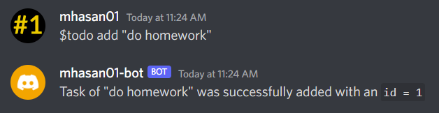
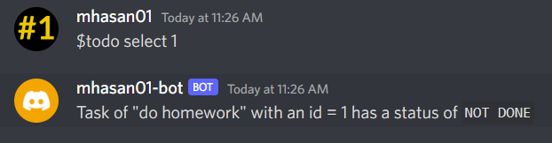
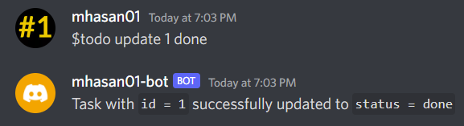
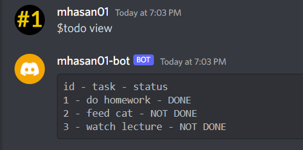
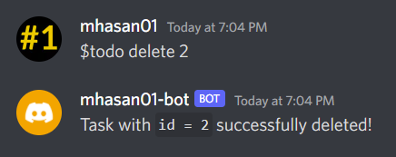
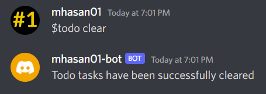

# Discord Bot


> Simple discord bot that can give you quotes and handle your todo tasks

## Technologies Used
- [Discord API](https://discord.com/developers)
- [Python](https://python.org/)
- [Quotes API - ZenQuotes.io](https://zenquotes.io/)
- [MySQL](https://www.mysql.com/)
- [Docker](https://www.docker.com/)

## Features
- Connects to a Discord Server
- Can give nice quotes
- Manage your To-Do tasks (CRUD):
  - Create a task
  - Read a task
  - Update a task
  - Delete a task
- Runs on Docker for easier execution

## Screenshots














## Setup

To run this project, here are the requirements:

- Docker
- Python (3.9)
- MySQL
- Discord Bot setup (You can follow this [guide](https://www.freecodecamp.org/news/create-a-discord-bot-with-python/))

To play around with the code please use [PyCharm](https://www.jetbrains.com/pycharm/) to open this project. 


## Usage

## Docker

To run this project, you can use [docker](https://www.docker.com/)!

First off, create a `.env` file (use the [`.env.example`](./.env.example) for reference)

Next, simply use this command to run the application:

```bash
docker-compose up
```

You will then see something similar to this:

```bash
...
discord-bot |                       INFO     connecting to database discord on        db.py:10
discord-bot |                                mysql:3306 as user root
discord-bot |                       INFO     creating table todo                      db.py:21
discord-bot | [2022-11-12 08:46:08] [INFO    ] discord.client: logging in using static token
discord-bot |                       INFO     logging in using static token       client.py:571
discord-bot | [2022-11-12 08:46:11] [INFO    ] discord.gateway: Shard ID None has connected to Gateway (Session ID: ---).
discord-bot | [2022/11/12 08:46;11] INFO     Shard ID None has connected to     gateway.py:560
discord-bot |                                Gateway (Session ID:
discord-bot |                                ----).
discord-bot | [2022/11/12 08:46;13] INFO     We have logged in as mhasan01-bot#--- main.py:15
```

## PyCharm

To run it locally, you can also use [PyCharm](https://www.jetbrains.com/pycharm/).

Make sure you make the `.env` first and configure the DB correctly.

- To run the application, you can execute the `main.py` (there should be a green indicator to execute it)
- To run the tests, you can click right on the folder [tests](./tests) and run the tests.

## Room for Improvement

Room for improvement:
- Add more functionality.
- More OOP classes could be implemented in the object.
- Add CI / CD for build / lint / test pipeline.
- Handle errors more gracefully

## Acknowledgements

- [FreeCodeCamp]([guide](https://www.freecodecamp.org/news/create-a-discord-bot-with-python/))
- Various codes on the internet
- StackOverflow answers


## Contact
Created by [mhasan01](https://mhasan01.com/) - feel free to contact me!
